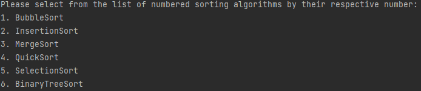

# Sorter

## Description
Developed a maven architecture project to learn about the implementation of different sorting algorithms. 
Most importantly practice:
- Implementing a design pattern (Factory design pattern is used in this project)
- Object-Oriented Programming principles (Abstraction, Encapsulation, Polymorphism, Inheritance)
- Test Driven Development (using JUnit 5 jupiter). 
- Logging using log4j to log the performance of each algorithms

The algorithms implemented in this project are:
- Bubble Sort
- Insertion Sort
- Merge Sort
- Quick Sort
- Selection Sort
- Binary Tree Sort

## Pre-requisites
- Maven
- JUnit 5 Jupiter
- log4j

## Executing program
- Sorter/src/main/java/com/sparta/sonam/sortmanager/main/Main.java - Execute the main class which will prompt you to
the command line.
  
- Sorter/src/main/java/com/sparta/sonam/sortmanager/sorters/ - Contains classes of all the sorting algorithms implemented
in this project. 
- Sorter/src/main/java/com/sparta/sonam/sortmanager/view/View.java - Contains the View class that is responsible 
for printing to the command line.
- Sorter/src/test/java/com/sparta/sonam/sortmanager/ - Contains all the test cases for the software system.

## Version History
- 0.1
    - Initial Release